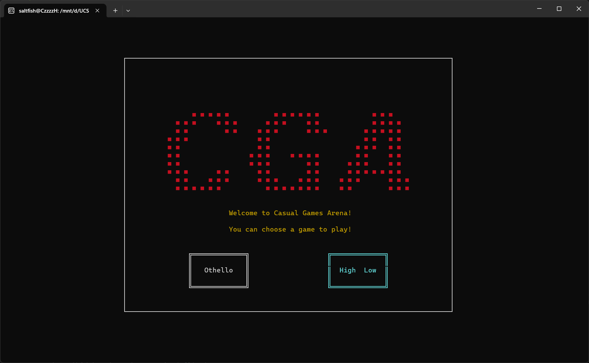

# CSE230-Project: Casual Games Arena


## Group Member
+ Xiaoda Li (xil204@ucsd.edu)
+ Yanran Li (aran230505a@gmail.com)
+ Yiqiao Qiu (y7qiu@ucsd.edu)
+ Chuhao Chen (chc091@ucsd.edu)


## Run App/Unit Test
 
```shell
stack setup
stack run
stack test
```

## Milestone 3: Completion

In this milestone, we not only completed the content of step 3, supplemented and optimized the unfinished aspects of step 2 (single-player mode/ online two-player mode), and addressed and fixed bugs present in the interface and game logic. 


## Milestone 2: Update

In this milestone, we have finished the whole **step 1** and part of **step 2** in our previous goals.

We have made a complete TUI application with a menu to choose game (the codes are at the git branch **CGA**). The key components of our application include a TUI client, where the players can choose a game to play (currently in single-player mode but then the network connection would be added). Each game itself is also a component, which contains the TUI and the game logic.



Currently we have finished the logic part of the two games. The two games can also be played in an independent application but only with simple TUI now (the codes are at the git branch **CardGame_logic** and **othello_logic**). 

We found the challenge of merging the game logic part the game TUI that are written by different people so far (this is actually the challenge of how our group can collaborate easily and efficiently), so we are still working on it. Our solution is focusing on the game state and discussing more to make sure that everyone understands the things in the game state. With a well defined game state it would be easier for us to combine these two parts. In addition, the network part might also be a challenge then.

We expect that we can meet our goals until the final deadline.


## Milestone 1: Proposal
We plan to implement a mini game platform in this project, on which players can play a collection of board and card games. Currently we plan to create two games on the platform: **Reversi** and **High Low**, and both of them are two-player games. The platform and the games will be implemented using the  [Brick](https://github.com/jtdaugherty/brick/) library and be run on a TUI.


### Overview of Reversi
In this project, we will implement the classic two-player strategy board game [Reversi](https://en.wikipedia.org/wiki/Reversi) that works on a $8\times 8$ grid. The two players are marked with color discs, typically black on one side and white on the other. The game always starts with a fixed initial grid. The players take turns place one disc of their color on the board, resulting in some of the opponent's discs being trapped between two of the player's discs and flipped to the capturing player's color. Whoever has the majority of their color discs on the board wins when the game ends with a fully occupied board.


### Overview of High Low
In this project, we will also implement the card game: "High Low." 
Initially, each player receives three randomly drawn cards from their deck. Gameplay involves selecting one card from three, comparing values, and the winner wins both cards. If two cards match, the next round's winner wins not only the current two cards but also any previous matching cards. The game ends when both players have no cards left in their hands, and the player with the greater total number of cards wins.

Tips:
+ Each player has a deck consisting of 2, 3, 4, 5, 6, 7, 8, 9, 10, J, Q, K, and A, a total of 13 cards. The card values increase from 2 to A.
+ Players can only see the cards in their own hands.
+ After each comparison, a new card is randomly drawn from the deck to replenish their hand, keeping it at three cards until there are no more cards in the deck.


### Goals

This project consists of the following goals organized as milestones.

#### Step 1
+ Basic setup with starter code (support `stack run` and `stack test`)
+ Basic TUI support including parsing players' action and visualizing the game board
+ Game logic in a standalone mode
#### Step 2
+ Complete TUI for each game with the [Brick](https://github.com/jtdaugherty/brick/) library
+ Networking support for two-player mode
+ Single-player mode, where the opposing player is controlled by computer
#### Step 3
+ Unit testing support either manually or using [quickcheck](https://hackage.haskell.org/package/QuickCheck)
+ Complete platform TUI with several user functions  (e.g. start menu, ranking board, etc)

